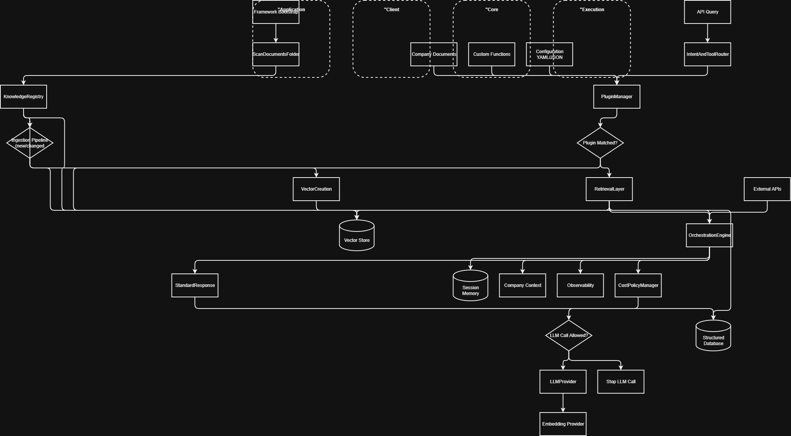
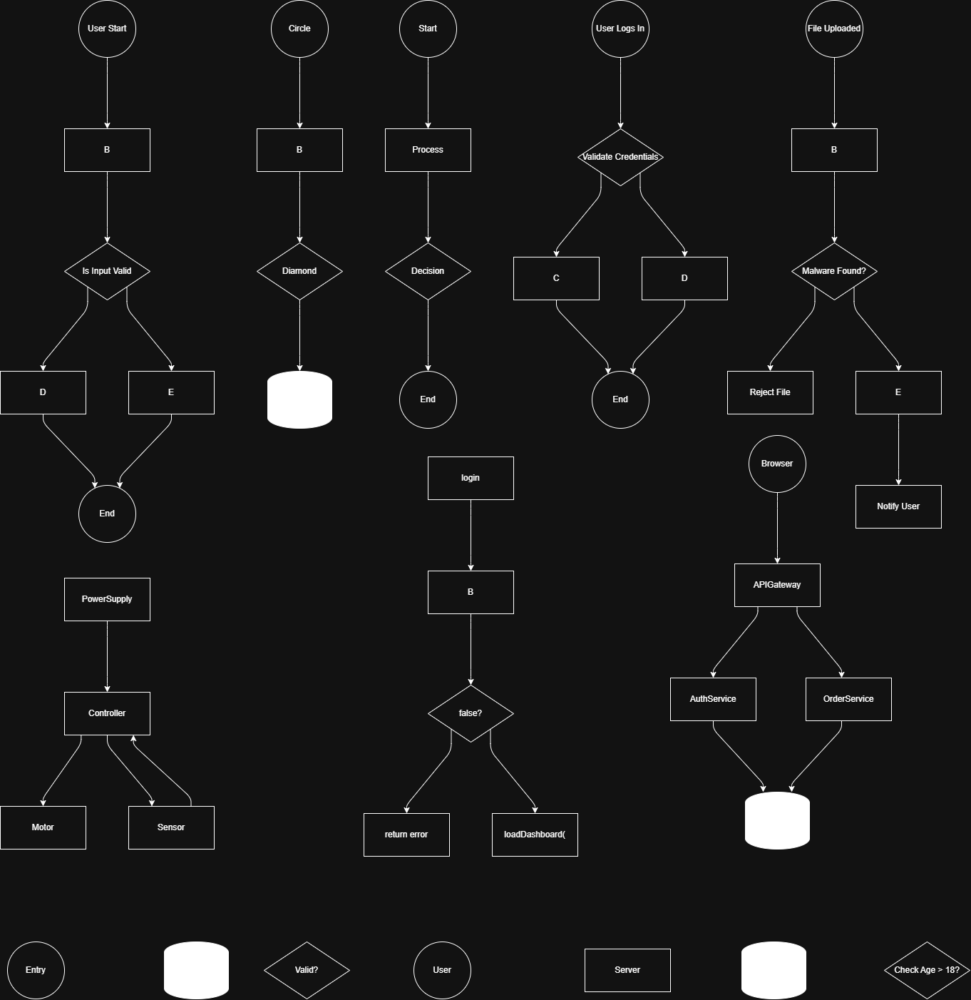

<meta name="google-site-verification" content="XXXXX" />

---
# AI Diagram Generator - Copilot for draw.io Desktop — text to  Diagram Generator
Draw Diagrams by using ai-drawio-copilot - auto-creates shapes, layouts, and connections from user instructions.
--- 
**New Feature Launch**
drawio-desktop-29.3.6-ai-copilot-v1.0.0
## 🚀 Download AI Copilot Build

 Installer - Click Below link to download drawio-ai-copilot:

👉 https://github.com/AI-Solutions-KK/drawio-ai-copilot/releases/latest

Includes:
- AI Copilot for diagram generation
- Auto layout + smart connectors
- Multi-model support (GPT / Gemini / Claude)
- Ready-to-install Windows package (.exe / .msi)

---
Sample From generated by copilot in 2 sec: 
---



---


---

---


---
# AI Copilot Launch- Draw.io — Smart Diagram Generator 

- Based on draw.io desktop v29.3.6 with AI Copilot enhancements

- AI Copilot for draw.io that draw any diagrams even most complex diagrams in 2 sec- 

- Diagrams — auto-creates shapes, layouts, and connections from user instructions.

Helps users quickly generate:
- flowcharts
- system architectures 
- process maps
- agent workflows
- trees, and connected diagrams — without manual block placement.

**This tool is designed for developers, architects, students, analysts, and product teams who want fast diagram creation from human-readable instructions.**

---

---
# 🔐 API Key Setup (Required)

AI Copilot needs an LLM API key to generate diagrams from natural language.

Steps:

-> AI-Copilot → Settings

-> Select your model provider

-> Paste your API key

Click Save

Generate diagram normally

No restart required.

### 🤖 Recommended Model Providers

Based on tested results and diagram quality:

✅ Preferred (Best diagram reasoning + structure):

Gemini - free

Claude - paid

⚠️ Use GPT only if needed

Works fine for simple flows

May produce weaker structure for very complex architectures compared to Claude/Gemini
as per individual experience


# 🔑 Where to Get API Keys

Claude → Anthropic Console

Gemini → Google AI Studio

GPT → OpenAI Platform

---
# AI- API Access Directory

| Provider | Model | Dashboard Link |
| :--- | :--- | :--- |
| **Google** | Gemini | [aistudio.google.com](https://aistudio.google.com/) |
| **Anthropic** | Claude | [console.anthropic.com](https://console.anthropic.com/) |
| **OpenAI** | GPT-4o / GPT-3.5 | [platform.openai.com](https://platform.openai.com/api-keys) |

---

## 🔑 Quick Setup Instructions

### 1. Google Gemini
* **Dashboard:** [Google AI Studio](https://aistudio.google.com/)
* **Steps:** 1. Sign in with your Google Account.
    2. Click **"Get API key"** in the sidebar.
    3. Click **"Create API key in new project"**.

### 2. Anthropic Claude
* **Dashboard:** [Anthropic Console](https://console.anthropic.com/)
* **Steps:** 1. Log in and navigate to the **"API Keys"** tab.
    2. Click **"Create Key"**.
    3. *Note:* You typically need to buy at least $5 in credits to start using the API.

### 3. OpenAI GPT
* **Dashboard:** [OpenAI Platform](https://platform.openai.com/api-keys)
* **Steps:** 1. Log in to your developer account.
    2. Click **"+ Create new secret key"**.
    3. Copy the key immediately; it will be hidden once you close the popup.

---


(Create key → copy → paste into Copilot Settings → Copilot Ready)
---

# Core Capabilities

### Natural Language → Diagram
Describe what you want in plain English — Copilot generates connected diagram structures automatically.

Examples:

- User login flow with validation and error branch
- Microservice architecture with API gateway and database
- HR and IT agent routing workflow

No strict syntax required.

---

### Supported Diagram Types

Copilot can generate:

- Flowcharts
- System architecture diagrams
- Agent workflows
- API & backend architecture
- Data pipelines
- Decision trees
- Control flow diagrams
- Service interaction maps
- Layered architecture
- Tool‑agent pipelines
- Validation flows
- Branching logic diagrams

---

### Simple + Complex Mode

Copilot adapts to request complexity.

Single Shape Mode examples:
- draw a circle
- create three rectangles
- add a database block
- draw five nodes not connected

Connected Flow Mode examples:

- Draw flow chart: start → process → decision → end

---

### Smart Intent Detection

Copilot detects:
- steps
- decisions
- branches
- loops
- tools
- repositories
- databases
- routers
- agents
- pipelines

---

### Auto Layout Engine

Generated diagrams are automatically:
- spaced properly
- non‑overlapping
- hierarchy aligned
- edge routed
- readable at scale

---

### Model Flexibility

Supports multiple AI providers selectable in settings depending on quality, speed, or quota.

---

## User Guide

Step 1 — Open Copilot panel inside Draw.io.

Step 2 — Enter diagram description using natural language.

Step 3 — Click Generate Diagram.

Step 4 — Edit shapes manually if needed (all output is standard Draw.io objects).

---

# Prompt Writing Guide

Best pattern: short step‑style flow description instead of essays.


---

## Tested Prompt Examples

You can copy paste below prompt as it is & see the magic

**Single Shapes**:
---
```
* Draw a diamond Shape
```
```
* Draw three circles named A B C
```
```
* Make one decision node called Valid?
```
---
**Basic flow:**
---
```
* Daw circle → square → diamond → database    connect all
```
```
* Draw Login flow:
User logs in → validate → if valid dashboard → else error → end
```


---
**Advanced Structures**
---

```
* Draw Start node called User Start.
Then process Validate Input.
Then decision Is Input Valid.
If yes go to Save Data.
If no go to Show Error.
Both paths end at End node
```
---
**Complex Architecture**
--

```Create a detailed architecture flow diagram for an agentic chatbot system.

Start from a UI / Web App / Corporate App where the user sends a message and later receives a response back.

Flow:

User message goes to a FastAPI chat endpoint.

From the endpoint, the message is sent to a Supervisor Router that controls routing and decisions.

The router also stores and fetches conversation context using a Memory Manager that connects to a Chat Repository and a Chat Sessions table database.

The Supervisor Router asks a decision question like “HR or IT request?” and performs intent classification.

From this decision, branch into two parallel agent paths:

Branch 1 — HR path:
Route to HR Agent.
HR Agent calls an HR Tool with parameters.
HR Tool writes data into Employee Repository.
Employee Repository stores into Employees Table database.
Results return back from HR Tool → HR Agent → LLM Client → Supervisor Router.

Branch 2 — IT path:
Route to IT Agent.
IT Agent calls an IT Tool with parameters.
IT Tool writes into IT Ticket Repository.
IT Ticket Repository stores into IT Tickets Table database.
Results return back from IT Tool → IT Agent → LLM Client → Supervisor Router.

Both HR Agent and IT Agent interact with a central LLM Client for reasoning and parameter parsing.

The LLM Client also receives past context from Chat Sessions storage.

Finally, Supervisor Router sends the final response back to FastAPI endpoint and then back to the UI app as user response.

Requirements:
- Show databases as database shapes
- Show agents and tools as process blocks
- Show router and LLM client clearly
- Show decision branching at router
- Show arrows for full round-trip flow
- Keep it as a connected architecture flow
```
---
**System Design**
---
---
```
Draw a layered GenAI architecture diagram with grouped sections and explicit connections.

GROUP: Application Startup
Framework Bootstrap -> Scan Documents Folder -> Knowledge Registry -> Ingestion Pipeline -> Vector Creation -> Vector Store

Knowledge Registry -> Ingestion Pipeline (only if new or changed)
Knowledge Registry -> Vector Store (if unchanged)

GROUP: Client / Developer Inputs
Company Documents -> Plugin Manager
Custom Functions -> Plugin Manager
Configuration YAML JSON -> Plugin Manager

GROUP: Core GenAI Framework
API Query -> Intent and Tool Router
Intent and Tool Router -> Plugin Manager

Plugin Manager -> Orchestration Engine (if plugin matched)
Plugin Manager -> Retrieval Layer (if no plugin)

Retrieval Layer -> Vector Store
Retrieval Layer -> Structured Database
Retrieval Layer -> Orchestration Engine

Orchestration Engine -> Session Memory
Orchestration Engine -> Company Context
Orchestration Engine -> Observability
Orchestration Engine -> Cost Policy Manager

Cost Policy Manager -> LLM Provider (allowed)
Cost Policy Manager -> Stop LLM Call (blocked)

LLM Provider -> Embedding Provider

GROUP: Execution Layer
External APIs -> Orchestration Engine
Orchestration Engine -> Standard Response

Standard Response -> Structured Database

Use:
- rectangles for services
- diamonds for decisions
- cylinders for databases
- grouped containers for each layer
- label decision edges: plugin matched / no plugin / allowed / blocked

```
---
## Tips for Better Results

- Use arrows or words like then, next, after
- Mention decisions explicitly
- Name components clearly
- Use yes/no branches
- Say “not connected” if no edges desired
- List architecture components and relationships

---

## Known Behavior

- Very complex diagrams need clearer step wording
- Dense graphs improve with ordered prompts
- No‑connection diagrams require explicit wording

---

## Ideal Use Cases

- Software architecture design
- Backend flow mapping
- Agent systems
- AI pipelines
- DevOps flows
- Business processes
- Decision trees
- Data pipelines
- API maps
- Tool orchestration diagrams

---

## Advantages

- Natural language driven
- No rigid syntax
- Simple to enterprise diagrams
- Clean auto layout
- Fully editable output
- Multi‑model compatible
- Fast diagram bootstrapping

---

AI Copilot accelerates diagram creation. Generate fast, refine visually, deliver professionally.

---

***Author & Copilot Developer***

***ML/AI- Professional*** - 
***Mr. Karan Kamble***  

Tech Profile :
https://github.com/AI-Solutions-KK


Linkedin Profile : https://www.linkedin.com/in/karan-tatyaso-kamble-b06762383/

---

FROM BASE REPO

About
----- 

**drawio-desktop** is a diagramming desktop app based on [Electron](https://electronjs.org/) that wraps the [core draw.io editor](https://github.com/jgraph/drawio).

Download built binaries from the [releases section](https://github.com/jgraph/drawio-desktop/releases).

**Can I use this app for free?** Yes, under the apache 2.0 license. If you don't change the code and accept it is provided "as-is", you can use it for any purpose.

Security
--------

draw.io Desktop is designed to be completely isolated from the Internet, apart from the update process. This checks github.com at startup for a newer version and downloads it from an AWS S3 bucket owned by Github. All JavaScript files are self-contained, the Content Security Policy forbids running remotely loaded JavaScript.

No diagram data is ever sent externally, nor do we send any analytics about app usage externally. There is a Content Security Policy in place on the web part of the interface to ensure external transmission cannot happen, even by accident.

Security and isolating the app are the primarily objectives of draw.io desktop. If you ask for anything that involves external connections enabled in the app by default, the answer will be no.

Support
-------

Support is provided on a reasonable business constraints basis, but without anything contractually binding. All support is provided via this repo. There is no private ticketing support for non-paying users.

Purchasing draw.io for Confluence or Jira does not entitle you to commercial support for draw.io desktop.

Developing
----------

**draw.io** is a git submodule of **drawio-desktop**. To get both you need to clone recursively:

`git clone --recursive https://github.com/jgraph/drawio-desktop.git`

To run this:
1. `npm install` (in the root directory of this repo)
2. [internal use only] export DRAWIO_ENV=dev if you want to develop/debug in dev mode.
3. `npm start` _in the root directory of this repo_ runs the app. For debugging, use `npm start --enable-logging`.

Note: If a symlink is used to refer to drawio repo (instead of the submodule), then symlink the `node_modules` directory inside `drawio/src/main/webapp` also.

To release:
1. Update the draw.io sub-module and push the change. Add version tag before pushing to origin.
2. Wait for the builds to complete (https://travis-ci.org/jgraph/drawio-desktop and https://ci.appveyor.com/project/davidjgraph/drawio-desktop)
3. Go to https://github.com/jgraph/drawio-desktop/releases, edit the preview release.
4. Download the windows exe and windows portable, sign them using `signtool sign /a /tr http://rfc3161timestamp.globalsign.com/advanced /td SHA256 c:/path/to/your/file.exe`
5. Re-upload signed file as `draw.io-windows-installer-x.y.z.exe` and `draw.io-windows-no-installer-x.y.z.exe`
6. Add release notes
7. Publish release

*Note*: In Windows release, when using both x64 and is32 as arch, the result is one big file with both archs. This is why we split them.

Local Storage and Session Storage is stored in the AppData folder:

- macOS: `~/Library/Application Support/draw.io`
- Windows: `C:\Users\<USER-NAME>\AppData\Roaming\draw.io\`

Not open-contribution
---------------------

draw.io is closed to contributions (unless a maintainer permits it, which is extremely rare).

The level of complexity of this project means that even simple changes 
can break a _lot_ of other moving parts. The amount of testing required 
is far more than it first seems. If we were to receive a PR, we'd have 
to basically throw it away and write it how we want it to be implemented.

We are grateful for community involvement, bug reports, & feature requests. We do
not wish to come off as anything but welcoming, however, we've
made the decision to keep this project closed to contributions for 
the long term viability of the project.
